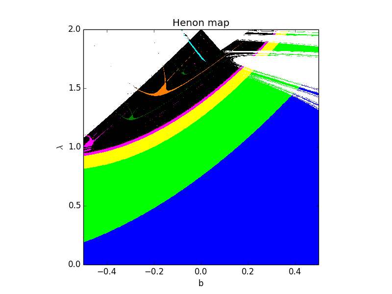

# Henon map

## Description

This is famous equation in nonlinear dynamics proposed in 1976. So, if you want to find information see Learn more

## Motivation

I'm not talking about physics. See, it's about two-parameter analysis of nonlinear system. 
+ What does it mean? 
  + First, we have two variables parameters. It means, welcome [**Data Parallelism**](https://en.wikipedia.org/wiki/Data_parallelism) - 
  [OpenMP](https://en.wikipedia.org/wiki/OpenMP), [Multiprocessing](https://docs.python.org/2/library/multiprocessing.html), GPU Parallel , etc.
 
  + Second, we have useful 'simple' task (you can create work tool for physicists solving big data problem), 
  except `test_sin_omp.c`. It was for test Open MP.

## Results

In the picture colors designate periods, 
black area corresponds to chaos, white - to divergence of iterations.

## Repository Includes

+ `henon.c`  - C file 
+ `henon.py` - Python file 
+ `henon_omp.c`   - C file using OpenMP
+ `henon_pool.py` - Python file using Multiprocessing
+ `plotter.py` - Python file made by [I.V. Sysoev](https://www.sgu.ru/en/node/5284). It needs for draw plot using special generated data file
+ `test_sin_omp.c` - C file using OpenMP for configuration test data

## Learn more

- [J.C. Sprott - Henon Map Correlation Dimension](http://sprott.physics.wisc.edu/chaos/henongp.htm)
- [Atlas of charts of dynamical regimes](http://sgtnd.narod.ru/science/atlas/eng/index.htm)
- [Wiki](https://en.wikipedia.org/wiki/H%C3%A9non_map)
- [Wiki2](https://wiki2.org/en/H%C3%A9non_map)
- [Original article](doc/Henon1976.pdf)

## Installation

+ `<name>.py` -> You can use [Python](https://www.python.org/) with data package: [Anaconda](https://www.anaconda.com/) or [Miniconda](https://conda.io/miniconda).
There's another way - use [Portable Python](http://portablepython.com/). Also you can use whatever IDE for Python.

+ `<name>.c` -> Make C project and copy code into the your project `main.c`

## License

Free